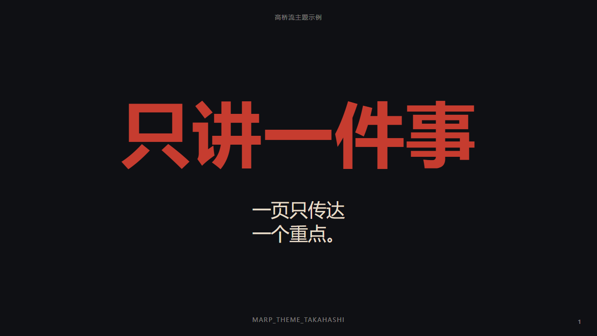

# A Takahashi Theme for Marp




一个面向中文演示场景的 Marp 自定义主题。整体风格基于 Takahashi 式大字演示，同时加入了偏中国风的配色体系，例如玄黑、月白、朱砂、姜黄和青金。

> 面向中文演讲场景的大字 Marp 主题，强调一页一个重点、强节奏和中国风配色。

仓库地址：<https://github.com/x5/marp-theme-takahashi>

## 快速开始

1. 安装 `Marp for VS Code`
2. 将 `themes/takahashi.css` 放到你的项目中
3. 在 `.vscode/settings.json` 中注册主题
4. 在 Markdown front-matter 中写入 `theme: takahashi`
5. 打开 Marp 预览开始使用

最小配置示例：

```yaml
---
marp: true
lang: zh-CN
theme: takahashi
paginate: true
---
```

## 目录

- [A Takahashi Theme for Marp](#a-takahashi-theme-for-marp)
  - [快速开始](#快速开始)
  - [目录](#目录)
  - [什么是 Takahashi 风格](#什么是-takahashi-风格)
  - [什么是 Marp](#什么是-marp)
  - [特性](#特性)
  - [目录结构](#目录结构)
  - [安装方式](#安装方式)
    - [方式一：直接下载或复制主题文件](#方式一直接下载或复制主题文件)
    - [方式二：克隆整个仓库](#方式二克隆整个仓库)
  - [在 VS Code 中使用](#在-vs-code-中使用)
    - [1. 安装扩展](#1-安装扩展)
    - [2. 注册主题](#2-注册主题)
    - [3. 在 Markdown 中启用主题](#3-在-markdown-中启用主题)
    - [4. 预览](#4-预览)
  - [在 Marp CLI 中使用](#在-marp-cli-中使用)
    - [方式一：直接指定主题文件](#方式一直接指定主题文件)
    - [方式二：注册主题目录，再在 Markdown 里用 `theme: takahashi`](#方式二注册主题目录再在-markdown-里用-theme-takahashi)
  - [最小示例](#最小示例)
  - [内置版式](#内置版式)
    - [完整页面 class 对照表](#完整页面-class-对照表)
    - [`lead`](#lead)
    - [`compact`](#compact)
    - [`invert`](#invert)
    - [`palette`](#palette)
  - [配色说明](#配色说明)
    - [完整颜色变量表](#完整颜色变量表)
  - [自定义建议](#自定义建议)
  - [示例文件](#示例文件)
  - [开发方式](#开发方式)
  - [适用场景](#适用场景)
  - [许可证](#许可证)

## 什么是 Takahashi 风格

Takahashi 风格通常指的是一种“超大字号、极少文字、强节奏”的演示方式。它的核心不是在一页里放更多内容，而是把每一页压缩成一个最重要的观点，让观众在几秒内就抓住重点。

这种风格通常有几个明显特点：

- 每页只讲一个信息点
- 标题极大，正文极少
- 强依赖演讲者口头补充，而不是把内容全写在页上
- 适合发布会、观点表达、教学开场、章节页和节奏感强的分享

这个主题不是对传统 Takahashi 风格的机械复刻，而是基于这种“大字、少字、强对比、强节奏”的思路，加入了更适合中文展示的排版和中国风配色。

## 什么是 Marp

Marp 是一个基于 Markdown 的演示文稿生态。你可以直接用 Markdown 写幻灯片内容，再通过主题 CSS 控制视觉样式，并导出为 HTML、PDF、PPTX 等格式。

如果你熟悉 Markdown，那么上手 Marp 会非常快。它特别适合这些场景：

- 用文本方式维护演示稿
- 把主题和内容分开管理
- 在 VS Code 中一边写一边预览
- 用 Git 管理演示文稿版本

Marp 的官方入口和相关链接：

- Marp 官网: https://marp.app/
- Marp for VS Code: https://marketplace.visualstudio.com/items?itemName=marp-team.marp-vscode
- Marp CLI: https://github.com/marp-team/marp-cli
- Marpit Theme CSS 文档: https://marpit.marp.app/theme-css

这个主题适合以下类型的内容：

- 发布会式演讲
- 观点表达型分享
- 培训开场和章节页
- 需要“大字、强节奏、少内容”的中文幻灯片

## 特性

- Takahashi 风格大字排版
- 中文优先的字体回退配置
- 中国风配色体系
- 支持封面页、紧凑列表页、反白强调页
- 可直接在 Marp for VS Code 中预览
- 可用于 Marp CLI 导出 HTML、PDF、PPTX

## 目录结构

- `assets/preview.png`: README 预览图
- `themes/takahashi.css`: 主题 CSS 文件
- `slides/demo.md`: 中文示例演示稿
- `.vscode/settings.json`: VS Code 工作区里的主题注册配置

## 安装方式

### 方式一：直接下载或复制主题文件

把 `themes/takahashi.css` 复制到你的 Marp 项目里，例如：

```text
your-slides/
	themes/
		takahashi.css
	slides/
		talk.md
```

### 方式二：克隆整个仓库

如果你想直接使用现成示例并继续修改，可以直接克隆这个仓库，然后从 `slides/demo.md` 开始。

## 在 VS Code 中使用

### 1. 安装扩展

安装 `Marp for VS Code` 扩展。

### 2. 注册主题

在项目的 `.vscode/settings.json` 中添加：

```json
{
	"markdown.marp.themes": [
		"./themes/takahashi.css"
	]
}
```

### 3. 在 Markdown 中启用主题

在你的演示稿开头写入 front-matter：

```yaml
---
marp: true
lang: zh-CN
theme: takahashi
paginate: true
---
```

### 4. 预览

打开 Markdown 预览，或者执行 `Marp: Open Preview to the Side`。

## 在 Marp CLI 中使用

如果你使用 Marp CLI，可以通过主题文件路径或主题目录启用该主题。

### 方式一：直接指定主题文件

```bash
marp slides/talk.md --theme themes/takahashi.css
```

### 方式二：注册主题目录，再在 Markdown 里用 `theme: takahashi`

```bash
marp --theme-set ./themes slides/talk.md
```

常见导出示例：

```bash
marp --theme-set ./themes slides/talk.md -o talk.html
marp --theme-set ./themes slides/talk.md --pdf -o talk.pdf
marp --theme-set ./themes slides/talk.md --pptx -o talk.pptx
```

## 最小示例

```markdown
---
marp: true
lang: zh-CN
theme: takahashi
paginate: true
---

<!-- _class: lead -->

# 只讲一件事

一页只传达一个重点。

---

## 强对比

深色底，暖色强调，极大层级。
```

## 内置版式

这个主题目前提供几个常用的 slide class，可通过 Marp 的 `class` / `_class` 指令启用。

### 完整页面 class 对照表

| class 名称 | 用途 | 典型写法 |
| --- | --- | --- |
| `lead` | 封面页、章节起始页、主标题页 | `<!-- _class: lead -->` |
| `compact` | 紧凑说明页、列表页 | `<!-- _class: compact -->` |
| `invert` | 反白强调页 | `<!-- _class: invert -->` |
| `palette` | 配色展示页，按列表项顺序着色 | `<!-- _class: palette -->` |

说明：

- 这些 class 都是作用在每一页的 `section` 元素上
- 更常见的写法是 `<!-- _class: ... -->`，只让当前页生效
- 如果写成 `<!-- class: ... -->`，则会持续影响后续页面，直到被新的 `class` 指令覆盖

### `lead`

用于封面页、章节起始页、主标题页。

```markdown
<!-- _class: lead -->

# 只讲一件事

一页只传达一个重点。
```

含义：

- `lead` 是这个主题定义的页面 class
- `<!-- _class: lead -->` 只作用于当前页
- `<!-- class: lead -->` 会从当前页开始持续影响后续页面，直到被新的 `class` 覆盖

效果：

- 一级标题更大
- 副标题更轻
- 适合作为开场页和关键页

### `compact`

用于较紧凑的列表页或说明页。

```markdown
<!-- _class: compact -->

### 列表也能用

- 一行一个点
- 每页不要太满
- 节奏要明显
```

效果：

- 字号略收紧
- 行高更适合列表内容
- 保持整页居中，但列表内部左对齐

### `invert`

用于反白强调页。

```markdown
<!-- _class: invert -->

# 反白页

适合做转场和强调。
```

效果：

- 浅色背景
- 深色正文
- 一级标题仍保留朱砂色强调

### `palette`

用于配色说明页。它通常与 `compact` 一起使用。

```markdown
<!-- _class: compact palette -->

### 中国风配色

- 朱砂：主强调色
- 姜黄：标题与重点
- 青金：冷静辅助色
- 月白：纸感留白
```

效果：

- 列表页保持紧凑排版
- 不同列表项按顺序应用不同颜色
- 适合做主题色展示页

注意：

- `palette` 当前不是按文字内容识别颜色
- 它是按列表项顺序上色：第 1 项、第 2 项、第 3 项、第 4 项分别对应不同颜色

## 配色说明

当前主题使用了一套偏中国风的颜色系统，核心色包括：

- 玄黑：主背景
- 月白：正文主色
- 朱砂：一级标题与强强调
- 姜黄：重点和辅助强调
- 青金：冷静辅助色
- 米土：次级文字和引用

如果你想改成自己的风格，优先修改 `themes/takahashi.css` 顶部的颜色变量，而不是在后面直接替换零散颜色。

### 完整颜色变量表

| CSS 变量名 | 中文名 | 值 | 主要用途 |
| --- | --- | --- | --- |
| `--color-xuanhei` | 玄黑 | `#0f1014` | 主背景、深色页基底 |
| `--color-songyan` | 松烟 | `#1a1f24` | 深色辅助背景备用 |
| `--color-sumi-edge` | 墨边 | `#2a3138` | 深色边缘辅助色备用 |
| `--color-yuebai` | 月白 | `#f7f3e8` | 正文主色、浅色留白 |
| `--color-mitu` | 米土 | `#e6dcc8` | 次级文字、引用文字 |
| `--color-zhusha` | 朱砂 | `#c63c2f` | `h1`、强强调色 |
| `--color-jianghuang` | 姜黄 | `#d5a021` | 强调文字、配色页标题 |
| `--color-qiuxiang` | 秋香 | `#c98b2e` | 暖色辅助色备用 |
| `--color-qingjin` | 青金 | `#6f8f89` | 冷静辅助色、配色页第 3 项 |
| `--color-cangqing` | 苍青 | `#2d4f5d` | 更深的冷色辅助备用 |
| `--color-danjin-glow` | 淡金光 | `rgba(213, 160, 33, 0.18)` | 早期发光效果保留变量，目前未直接使用 |
| `--color-zhusha-glow` | 朱砂光 | `rgba(198, 60, 47, 0.12)` | 早期发光效果保留变量，目前未直接使用 |
| `--color-paper-glow` | 纸光 | `rgba(247, 243, 232, 0.08)` | `code` 背景和轻微高亮底色 |

补充说明：

- 当前 README 里提到的“核心色”是面向使用者的简化描述
- 上表才是主题 CSS 里目前定义的完整变量集合
- 其中一部分变量是主用色，一部分是备用或轻效果变量

## 自定义建议

你通常会改这几个地方：

- `:root`: 页面尺寸、背景、基础字体、基础字号
- `h1`, `h2`, `h3`: 标题层级
- `section::after`: 页码样式
- `section.lead`, `section.compact`, `section.invert`, `section.palette`: 页面变体
- 顶部颜色变量：整套主题配色

## 示例文件

仓库里自带一个中文示例：

- `slides/demo.md`

建议先打开这个文件看预览，再从内容或配色开始改。

## 开发方式

如果你要继续迭代这个主题，推荐工作流是：

1. 打开 `slides/demo.md`
2. 打开 Marp 预览
3. 修改 `themes/takahashi.css`
4. 实时观察版式变化

## 适用场景

推荐：

- 10 到 30 页以内的演讲稿
- 强调情绪和节奏的内容表达
- 每页 1 到 3 个信息点的演示风格

不推荐：

- 大量表格或复杂图表
- 高密度报告型 PPT
- 一页需要承载很多段落正文的材料

## 许可证

本项目使用 MIT License 开源。你可以自由使用、修改、分发，并在保留许可证声明的前提下用于个人或商业项目。

完整许可证内容见 `LICENSE` 文件。